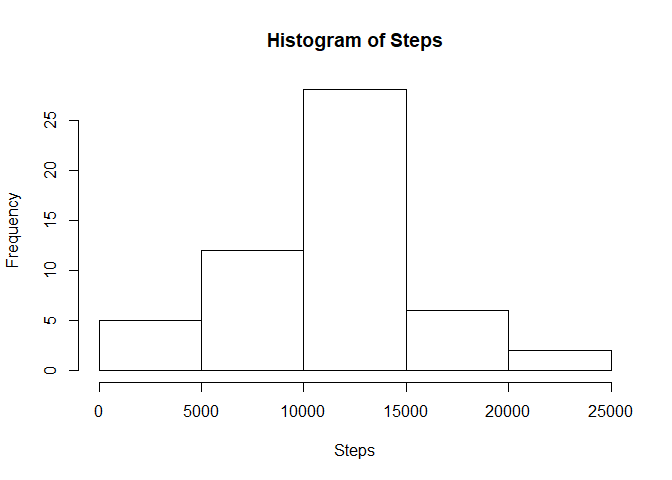
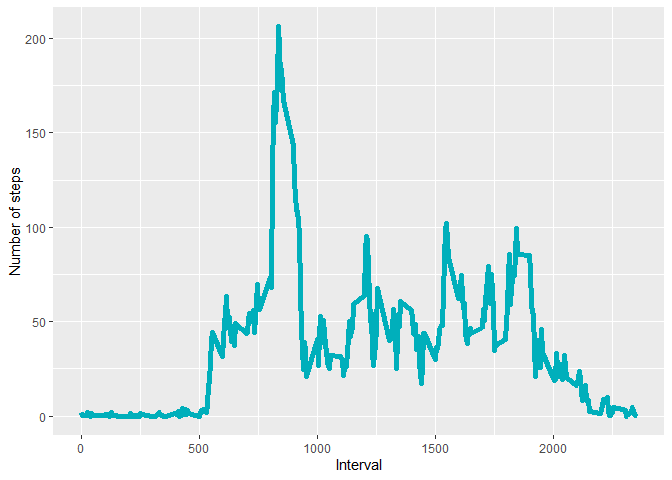
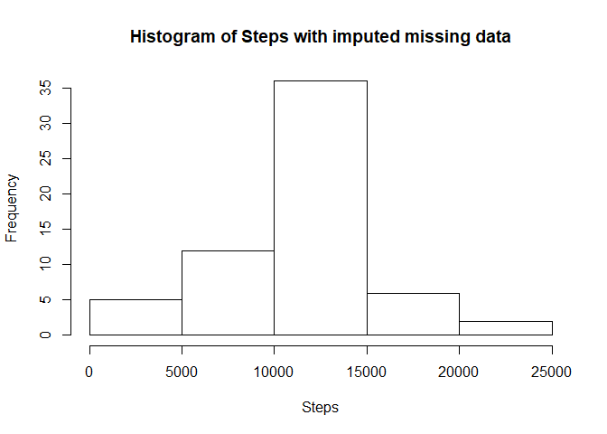
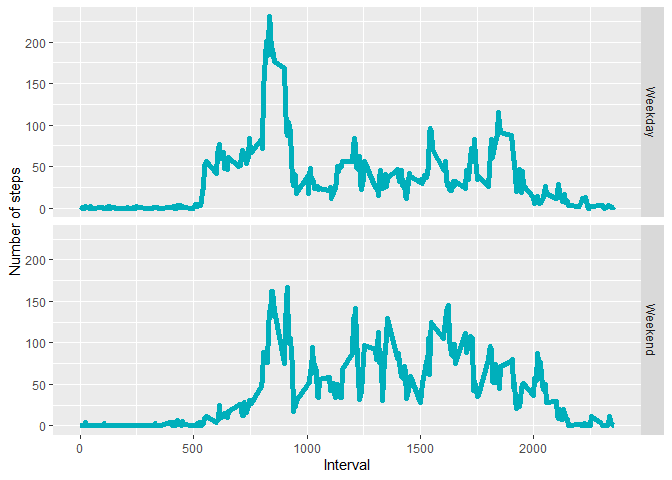

### 1. Code for reading in the dataset and/or processing the data

```r
library(dplyr)
```

```
## 
## Attaching package: 'dplyr'
```

```
## The following objects are masked from 'package:stats':
## 
##     filter, lag
```

```
## The following objects are masked from 'package:base':
## 
##     intersect, setdiff, setequal, union
```

```r
library(ggplot2)
myactivity <- read.table("activity.csv",sep=",",header=TRUE,na.strings = "NA")
myActSummary <- myactivity %>%
      select(steps,date) %>%
      group_by(date)  %>%
      summarize_each(sum) 
myActSummaryTimeAvg <- myactivity %>%
      select(steps,interval) %>%
      group_by(interval)  %>%
      summarize_all(list(mean = mean), na.rm = TRUE)
```
### 2. Histogram of the total number of steps taken each day

```r
hist(myActSummary$steps,main="Histogram of Steps", xlab="Steps")   
```

<!-- -->

```r
myMean <- mean(myActSummary$steps,na.rm=TRUE)  
myMedian <- median(myActSummary$steps,na.rm=TRUE)  
```
### 3. The mean total number of steps taken per day is 10,766.19 and the median is 10,765.   

### 4. Time series plot of the average number of steps taken


```r
ggplot(data = myActSummaryTimeAvg, aes(x = interval, y = mean)) +
  geom_line(color = "#00AFBB", size = 2) +
  labs(x="Interval",y="Number of steps")
```

<!-- -->

```r
IntMaxSteps <- myActSummaryTimeAvg %>%
               filter(mean== max(myActSummaryTimeAvg$mean))%>%
               select(interval)
IntMaxSteps <- as.character(as.integer(IntMaxSteps))                      
hour <- paste(c(rep("0",(4-nchar(IntMaxSteps)))),IntMaxSteps,sep="")
hour <- paste(substr(hour,1,2),":", substr(hour,3,5),sep="")
```
### 5. The 5-minute interval that, on average, contains the maximum number of steps is 08:35. 


```r
missing <- nrow(myactivity) - sum(complete.cases(myactivity))
gooddata <- myactivity[complete.cases(myactivity),]
```
### 6. The total number of rows with missing values is 2,304. 
### 6. Code to describe and show a strategy for imputing missing data

```r
updatenulls <- function(x,y) {
      thisstep <- y
      if(is.na(y)){
         thisstep <- filter(myActSummaryTimeAvg,interval==x)$mean
      }
      thisstep
}
steplist <- mapply(updatenulls,myactivity$interval,myactivity$steps)

myNewActivity <- cbind(myactivity,steplist) %>%
            mutate(steps=steplist) %>%
            select(steps,date,interval,-steplist)

myActSummaryNew <- myNewActivity %>%
      select(steps,date) %>%
      group_by(date)  %>%
      summarize_each(sum) 


myActSummaryTimeAvgNew <- myNewActivity %>%
      select(steps,interval) %>%
      group_by(interval)  %>%
      summarize_all(list(mean = mean), na.rm = TRUE)
```
### 7. Histogram of the total number of steps taken each day after missing values are imputed

```r
hist(myActSummaryNew$steps,main="Histogram of Steps with imputed missing data", xlab="Steps")   
```

<!-- -->

```r
myNewMean <- mean(myActSummaryNew$steps,na.rm=TRUE)  
myNewMedian <- median(myActSummaryNew$steps,na.rm=TRUE)  
```
### 7. The new mean total number of steps taken per day is 10,766.19 and the new median is 10,766.19. 


```r
getDayType <- function(x) {
      dayType <- "Weekday"
      if(weekdays(x) %in% c("Sunday", "Saturday"))
      {
         dayType <- "Weekend"
      }
      dayType
}

myNewActivity$dayType <- sapply(as.POSIXct(as.character(myNewActivity$date)),getDayType)
myNewActivity$dayType <- as.factor(myNewActivity$dayType)
myActSummaryDayType <- myNewActivity %>%
      select(dayType,steps,interval) %>%
      group_by(dayType,interval)  %>%
      summarize_all(list(mean = mean), na.rm = TRUE)
```
### 8. Panel plot comparing the average number of steps taken per 5-minute interval across weekdays and weekends

```r
ggplot(data = myActSummaryDayType, aes(x = interval, y = mean)) +
  geom_line(color = "#00AFBB", size = 2) +
  facet_grid(dayType~.) +
  labs(x="Interval",y="Number of steps")
```

<!-- -->

### 9. All of the R code is above! 


